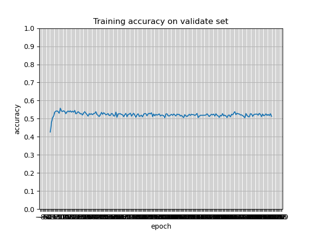
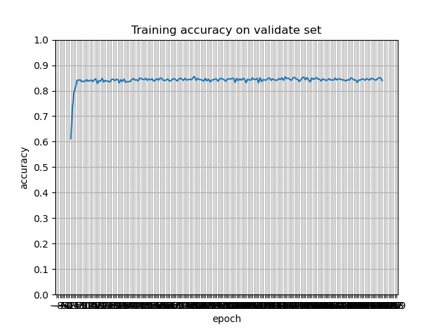
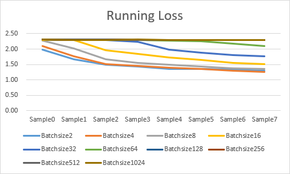

# A Tuning Experiment on CIFAR-10

## About

This repository contains:

- [models](https://github.com/StanfordVL/taskonomy/tree/master/taskbank) [PyTorch].
- [code](https://github.com/StanfordVL/taskonomy/tree/master/code)
- results and hyper-parameter analysis

| About This Program                                           | Dataset                                                      |
| :----------------------------------------------------------- | :----------------------------------------------------------- |
| This program is a classifier experiment on CIFAR-10 dataset based on Pytorch. The aim of this project is to implement several classic method including LeNet, VGG and ResNet, while tuning the hyper-parameters to make the net do as better as possible on the target. | [CIFAR-10 ](http://www.cs.toronto.edu/~kriz/cifar.html) is an established computer-vision dataset used for object recognition. It is a subset of the [80 million tiny images dataset](http://groups.csail.mit.edu/vision/TinyImages/) and consists of 60,000 32x32 color images containing one of 10 object  classes, with 6000 images per class. It was collected by Alex  Krizhevsky, Vinod Nair, and Geoffrey Hinton. |
|                                                              |                              |

## Training Process

This project use pytorch as the  program framework, so this program contains the dataset, neural net, optimizer and result handler.

## Results

| epoch/accuracy on validate | FC2  | LeNet5 | VGG16  | ResNet18 |
| :------------------------- | ---- | ------ | ------ | -------- |
| 1                          | 44%  | 49.00% | 40.80% | 69.12%   |
| 5                          |      | 60.34% | 54.12% | 76.84%   |
| 10                         |      | 62.72% | 59.98% | 83.76%   |
| 50                         |      | 58.52% | 71.90% |          |
| 100                        |      | 57.34% | 76.48% |          |
| 200                        |      |        |        | 84.73%   |

## Experiment on some hyper-parameter

### Batch-Size

Dividing data into batches is a commonly used training technique. The correct choice of batch-size is to find the best balance between memory efficiency and memory capacity. Since this project uses SGD as the network optimization method, batch-size can affect the optimization effect, convergence speed and training iteration speed of the entire net.

The running loss of tuning batch-size on **LeNet5** in 2 epoch are as follows:

| Batchsize | Batchsize2 | Batchsize4 | Batchsize8 | Batchsize16 | Batchsize32 | Batchsize64 | Batchsize128 | Batchsize256 | Batchsize512 | Batchsize1024 |
| --------- | ---------- | ---------- | ---------- | ----------- | ----------- | ----------- | ------------ | ------------ | ------------ | ------------- |
| Sample0   | 1.99       | 2.101      | 2.275      | 2.303       | 2.304       | 2.304       | 2.305        | 2.304        | 2.304        | 2.304         |
| Sample1   | 1.67       | 1.768      | 2.01       | 2.293       | 2.299       | 2.302       | 2.303        | 2.303        | 2.304        | 2.303         |
| Sample2   | 1.49       | 1.514      | 1.661      | 1.963       | 2.29        | 2.3         | 2.304        | 2.304        | 2.304        | 2.303         |
| Sample3   | 1.43       | 1.453      | 1.556      | 1.835       | 2.239       | 2.297       | 2.303        | 2.303        | 2.303        | 2.304         |
| Sample4   | 1.36       | 1.386      | 1.497      | 1.726       | 1.973       | 2.281       | 2.302        | 2.302        | 2.303        | 2.303         |
| Sample5   | 1.36       | 1.357      | 1.436      | 1.654       | 1.883       | 2.249       | 2.302        | 2.302        | 2.303        | 2.302         |
| Sample6   | 1.33       | 1.298      | 1.377      | 1.549       | 1.811       | 2.176       | 2.301        | 2.302        | 2.303        | 2.303         |
| Sample7   | 1.30       | 1.258      | 1.36       | 1.501       | 1.755       | 2.098       | 2.3          | 2.301        | 2.303        | 2.302         |

It is obvious that batch size 2 and 4 have a better performance on training.

### Epoch

### learning rate

